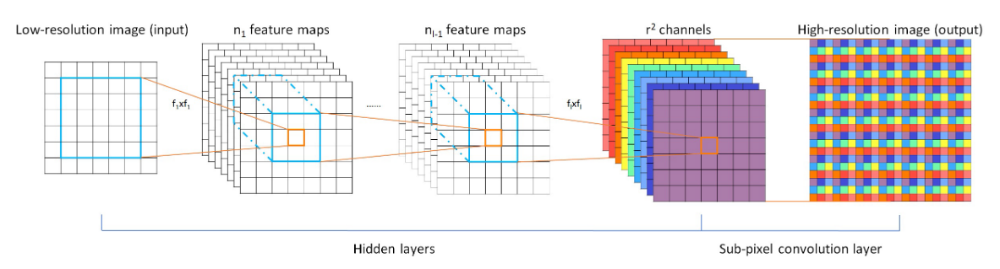
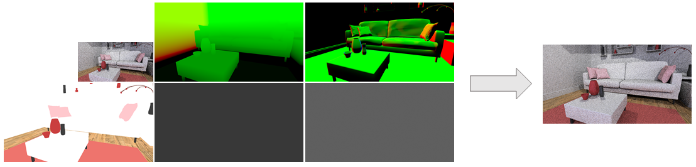
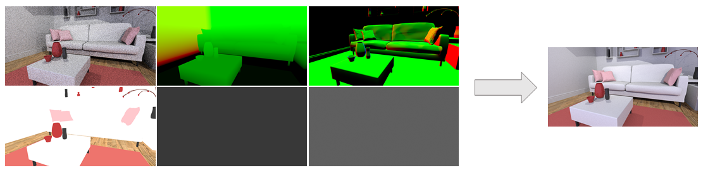
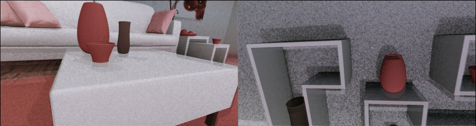
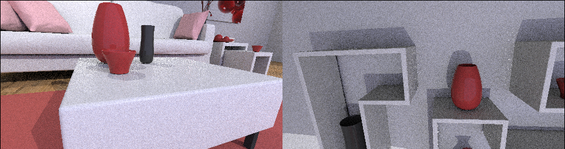
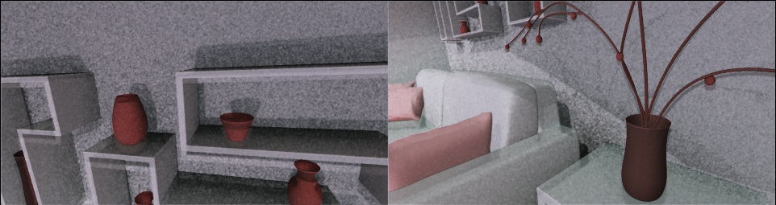
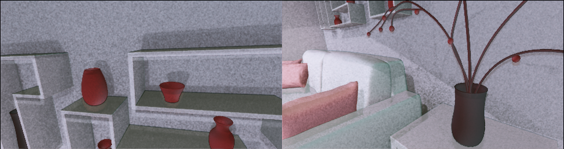
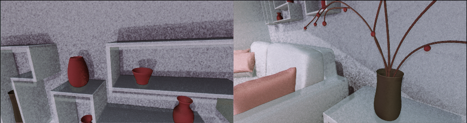
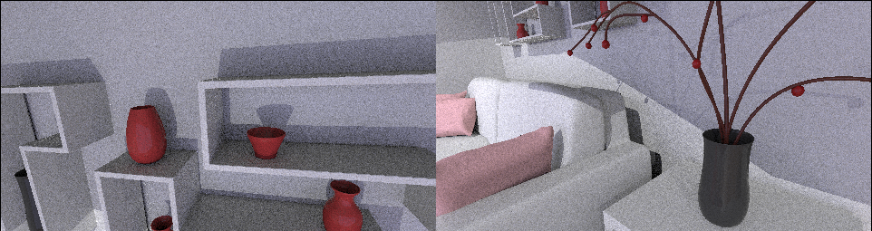

# DLSS In 3 Weekends

  

## Background

Real time raytracing has become a killer feature of many AAA game releases. With the advancement in deep-learning architectures, there has been a push to use machine learning to help accelerate the raytracing process in a variety of methods from sample prediction to image space denoising. One of the proposed solutions to this problem is to perform ray-tracing at a low resolution and low sample count, apply some learned upsampling technique to reach the desired resolution, and then apply a denoising filter to clean up the noise from the stochastic samples.

This is the approach essentially touted by Nvidia's DLSS system (Burnes 1). For this project we seek to create a system that can similarly perform upsampling and denoising for a ray-traced image for use in real time applications. 

To achieve the goal of real-time performance, our upscaling and denoising system must meet a certain frame-time constraint. To make our lives a bit easier, we define a "real time"  performance to be a system that can go from a ray-trace call to final output in at least 33 ms (30 frames per second). However, we also want our model to produce somewhat accurate results, so we also constrain our model to have at least as good quality results as a full resolution 4spp ray traced image (which can be done in about 26 ms) in, at most, the same amount of time. 

What this means concretely is that our system must have a PSNR greater than or equal to a 4spp ray-traced image in our validation dataset and be able to infer this result within 26 ms (the performance target of 4spp). This translates to an approximate ~22 ms of model inference budget.

Our inputs to our system are:
1. A 540p 1spp ray traced image
2. A 1080p G-buffer containing world space position, world space normal, albedo, index of refraction, and specular roughness.

The output of our system should be a single high quality (compared to a 32 spp ray-traced frame) 1080p ray traced image per input frame.

## Approach

Our design principles for our system:
1. Performant: We need the system to run at minimum 30 fps in order to achieve 
2. Clean: Attempt to achieve 32spp level quality.
3. Low Memory Consumption: Our model should be able to fit on a commercial GPU along with the image & gbuffer.

### Dataset

For our dataset, we chose a single example scene from Falcor called "pink room" as our test set. We chose Falcor as our data generation engine since it is quite easy to use and we could easily integrate our data collection code with the extensive tutorials provided by Chris Wyman. We based our scene code off tutorial 14 of his "Getting Started with RTX Ray Tracing" series which incorporates: light probe based gbuffers, area lights, GGX environment maps, and simple tone-mapping. Also Falcor's ray-tracing API is entirely built off of the DirectX 12 API which allowed us to use the RTX cores available on our development GPU and accurately calculate frame-time performance for various shader passes.

To capture the dataset, we built on top of the existing api to do create a single button interface to capture the 23 channels of data we needed for each training point, dumped to .exr files.

Since the goal of our system is to test the performance and quality of our model, not necessarily generalizability, we gathered our data from this single room.
The views we used for our train and validation dataset come from a single animated camera path. We did randomly shuffle the data points captured to ensure generalizability across different views of the scene. Moreover, our test set comes from an entirely different animated camera path (though it is used mostly for qualitative analysis). 

We gathered 1000 data-points for our train and val set and another 150 data-points for our test. Per data-point we gather quite a deal of information.
1. 540p   1spp ray-traced frame (3 channels)
2. 1080p 1spp ray-traced frame (3 channels)
3. 1080p 4spp ray-traced frame (3 channels)
4. 1080p 32 spp ray-traced frame (3 channels)
5. 1080p g-buffer (11 channels)

So in total we gather 20 channels of 1080p data and 3 channels of 540p data. Since we capture each feature map in a 16bit .exr for training, this came out to ~180 gb of train/val data. Our test dataset is compressed and only 150 data-points so it is a bit smaller, ~3.5 gb.

### Models

#### Super Resolution
Super Resolution has been a common application of deep networks for the past four years. Models have used CNNs, ResNets, GANs, etc. However given the design principles of speed and low memory overhead, our model needs to have both fast execution time and be fairly compact. For this work, we chose ESPCN  due to its small size and the fast inference capability (Shi 3). The model is able to achieve all three of our specs due to it's efficient sub-pixel convolution layer. A sub-pxiel convolution layer is a convolution with a stride of 1/r. This paper makes this convolution layer faster by exploiting some mathematical properties when the layer is periodically shuffled. The following figure is similar to the model we implemented for super resolution (Shi 3).

  

In our experiments we would modify the input channels to experiment with various input combinations such as half-resolution and g-buffer. We changed the internal filter size to fit the budget we need to have fast execution and small model size. 

  

#### Denoise
Enlightened by Disney's publication in 2018 (Bako 2), we chose to adapt the oringal KPCN, which is made for offline denoising, in out real time rendering settings. In order to denoise the input within the given amount of time (~8ms), we both reduced the number of layers and the size of predicted denoising kernel. The following figure illustrates our light version of KPCN.

  

The input of our network is a stacked N x 14 x H x W channel input, where N is the batch size and H and W are the height and weight in full resolution. The 14 channels include the output from the super resolution network and all additional information from the g buffer used in super resolution as well. Since we can directly reuse the g buffer generated, there's little cost in getting desired input for the denoise network.

  

The network outputs a N x 9 x H x W tensor as the predicted 3 x 3 denoising kernels for each pixel. We then denoise the output from the super resolution network with these pixel-level filters.

### Integration
The first experiments we performed involved finding the right models for the tasks. We ran multiple experiments and tried to find models that yielded good inference time and a low memory consumption. One of the constraints we worked with was ensuring that we could load the full resolution gbuffer and half res image into memory alongside the model without going outside of 8 GB of memory. We performed additional tests for profiling the models and using fp16 for training/inference. Given that the new line of GPUs from NVIDIA have Tensor Cores, we hoped to leverage their speed for some speed gains.

After hitting our allocated budgets, we explored various training schemes to improve our model's performance. They included individually training the sub models, end-to-end training, and concurrent training with blocking gradients between models.

## Results

As defined in our design principles our system's success is defined by the inference speed, quality of the image, and the memory consumption of the model. The metrics we would use to quantify these specs are time, psnr/qualitative inspection, and model size. Every image metric associated with quality has edge cases where it fails. Hence, we need a human in the loop to validate the quality.

Overall we succeded in most of our goals for this project. Firstly, we exceeded the PSNR of 4spp with respect to 32spp by ~2x with nearly all of our final models. Moreover, our outputs had an overall lower frame time budget and were temporally stable without the need of motion vectors. However, qualitatively our results seem to need some work. For example, our model has issues with ghosting, color accuracy, and low frequency noise artifacts.

All the experiments with relation to timing was performed on a machine with a Ryzen 3700X, 16 GB of RAM, and RTX 2070 Super.

### Model Exploration/Improving Speed
We explored various architectures that used UNets, ResNets, Convolutional Autoencoders, etc. and finally settled on the two models described above. We timed the various models and model parameters until we converged to a configuration that fit in our budget. Below we see the timings for a given frame at fp16. The fp32 versions of these models run at a 25% performance cost in time. 

| |Super Resolution|Denoiser|
|:-:|:-:| :-: |
| Inference Time (ms)|8.802| 8.320 |

Below are the timing results for the RTX 2070 Super for generating the data required for our models. These times are critical since they directly provide us with our frame-time budget for our entire model step.
| |530x960 1 spp|1060x1920  gbuffer|1060x1920 1spp|1060x1920 4spp|1060x1920 32spp|
|:-:|:-:|:-:|:-:| :-: | :-: | 
| Frame-time (ms)| 2.90  | 2.2 |6.50 |26.0 | 208 |
|Frames per second|101|125|28.1|7.25 |.906 |

### Improving Bandwidth/Input Size
We wanted to explore the impact of data types on the performance of the model. So we looked at various inputs such as half image only, half image with partial g-buffer, and half image with full g-buffer. These experiments are critical to potentially reducing the amount of memory used in VRAM since most of the memory usage is for the images. Our work didn't experiment with changing the inputs to the denoising model since the original work used the full gbuffer to guide the denoiser.

| Experiments   | Train Loss        | Train PSNR  | Val Loss          | Val PSNR    |
|:---------------:|:-------------------:|:-------------:|:-------------------:|:-------------:|
| Experiment 2a (Half Image Input) | 0.4513            | 10.45       | 0.4537            | 10.42       |
| Experiment 2b (G Buffer Input)| 0.04268           | 10.68       | 0.04248           | 10.71       |
| Experiment 2c (Half Image + G Buffer Input)| 0.04134           | 10.85       | 0.04138           | 10.84       |
| Experiment 3a (Full Image + G Buffer Input))| 8.16e-3           | 20.89       | 7.93e-3           | 21.04       |

Note: All PSNR/loss is calculated against 1080p 32 spp ray-traced frames 

### Improving Image Quality/Final Results
For our final experiments, we attempted to improve image quality by trying different training procedures beyond simply end-to-end training. The first number in the PSNR columns is calculating the PSNR of the output of the super-resolution part of the network to 1080p 1spp. The second number in the column is the final output image compared to 1080p 32 spp

| Experiments   | Train Loss        | Train PSNR  | Val Loss          | Val PSNR    |
|:---------------:|:-------------------:|:-------------:|:-------------------:|:-------------:|
| Experiment 4a (Pre Trained from 2c, 3a) | N/A               | N/A         | N/A               | 17.43       |
| Experiment 4b (Concurrent Training, No Grad Flow @ Inputs)| 0.4066/0.0149     | 10.9/18.27  | 0.0415/0.0154     | 10.82/18.15 |
| Experiment 4c (End-to-End Training)| 6.9275e-3         | 10.43/21.65 | 6.5194e-3         | 10.34/21.9  |
| Experiment 4d (End-to-End Training (2 Heads))| 0.08276/8.2073e-3 | 10.84/20.89 | 0.08455/7.8941e-3 | 10.74/21.05 |

Note: All PSNR/loss is calculated against 1080p 32 spp ray-traced frames 

Here are the results on the val set, comparing 1spp and 4spp 1080p ray traced images to 32 spp 1080p. As you can see all of our models beat these baselines handily. 

#### Baseline Ray-Traced Results 
|               | PSNR   |
|---------------|--------|
| 1spp -> 32spp | 10.472 |
| 4spp -> 32spp | 10.42  |

#### Experiment4a Results

  

  

The first row of images comes from experiment 4a and the second row is corresponding ground truth. Using these two pretrained models, that have not seen each other's input/output distributions we can see that the ensemble fails to output the correct ray traced reflections and colors. However, it does reduce much of the high frequency noise from the input. Given these results we wanted to train a denoiser model that was trained on the distribution of data that came from the the super sampling model.

#### Experiment4b/c/d Results

  
  
  

  

Rows one, two, and three of the above set of images are the outputs of experiments 4b, 4c, and 4d. Row four is the ground truth for these three experiments.

After training the models concurrently but not letting the gradients pass through the inputs for each sub model, we can barely see an improvement in the quality of the image (4b). This is also reflected in the PSNR. The next obvious training scheme was to train an end-to-end model where the input was a half-res w/ gbuffer and the output was a supersampled/denoised image (4c). Here we can see that the model is starting to learn the correct lighting of scene asn we can even see a few blobs of reflections in experiment 4c. 4d is essentially experiment 4c but we also pass back gradients based on comparing the output of the ESPCN super-resolution model to 1080p 1spp. Our rationale was to add more signal on what each sub-model was supposed to accomplish. Here we can see that the highlights in the flower part are definitively more bright than that of 4c.

### Takeaways

It is possible to do DLSS. It's just incredibly difficult without a lot of compute and data. Here are a few more detailed insights:

* One common phenomenon that is persistent across all our images is a ghosting effect. At first we thought this might be a fault in our model but after further inspection it seems like our data preprocessing before passing it into the neural network might be stretching the physical extent of objects in the image.

* Super resolution works but the approach we took to trainig it might be flawed. It might be better to perform model distillation instead of reducing the size of the model and training from scratch.

* Generally our model does not have temporal stability issues but we do have issues in darker regions of the image such as shadows. Maybe exploring motion vectors/recurrence structure in the model could help improve the stability.

* The GPU is only part of the system. When we used a VM, we ran into massive slowdows in training due to disk i/o since the storage is distributed. Quite often our compute would be left idling while the process was focused on fetching data from disk. In addition, system temperature can have a large impact on performance. After installing proper coooling on the machine with the 2070 Super, we saw a 25x in training speed.

### References
1. Burnes, Andrew. “NVIDIA DLSS 2.0: A Big Leap In AI Rendering.” Artificial Intelligence Computing Leadership from NVIDIA, Nvidia, 23 Mar. 2020, www.nvidia.com/en-us/geforce/news/nvidia-dlss-2-0-a-big-leap-in-ai-rendering/.
2. Bako, Steve, et al. "Kernel-predicting convolutional networks for denoising Monte Carlo renderings." ACM Trans. Graph. 36.4 (2017): 97-1
3. Shi, Wenzhe, et al. "Real-time single image and video super-resolution using an efficient sub-pixel convolutional neural network." Proceedings of the IEEE conference on computer vision and pattern recognition. 2016.
