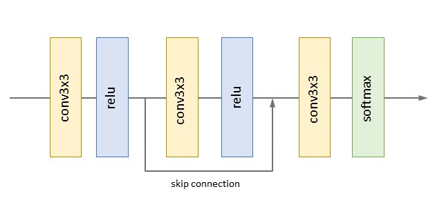

# DLSS In 3 Weekends

  

## Background

Real time raytracing has become a killer feature of many AAA game releases. With the advancement in deep-learning architectures, there has been a push to use machine learning to help accelerate the raytracing process in a variety of methods from sample prediction to image space denoising. One of the proposed solutions to this problem is to perform ray-tracing at a low resolution and low sample count, apply some learned upsampling technique to reach the desired resolution, and then apply a denoising filter to clean up the noise from the stochastic samples.

This is the approach essentially touted by Nvidia's DLSS system (**CITATION HERE**). For this project we seek to create a system that can similarly perform upsampling and denoising for a ray-traced image for use in real time applications. 

To achieve the goal of real-time performance, our upscaling and denoising system must meet a certain frame-time constraint. To make our lives a bit easier, we define a "real time"  performance to be a system that can go from a ray-trace call to final output in at least 33 ms (30 frames per second). However, we also want our model to produce somewhat accurate results, so we also constrain our model to have at least as good quality results as a full resolution 4spp ray traced image (which can be done in about 26 ms) in, at most, the same amount of time. 

What this means concretely is that our system must have a PSNR greater than or equal to a 4spp ray-traced image in our validation dataset and be able to infer this result within 26 ms (the performance target of 4spp). This translates to an approximate ~22 ms of model inference budget.

Our inputs to our system are:
1. A 540p 1spp ray traced image
2. A 1080p G-buffer containing world space position, world space normal, albedo, index of refraction, and specular roughness.

The output of our system should be a single high quality (compared to a 32 spp ray-traced frame) 1080p ray traced image per input frame.

## Approach

Our design principles for our system:
1. Performant: We need the system to run at minimum 30 fps in order to achieve 
2. Clean: Attempt to achieve 32spp level quality.
3. Low Memory Consumption: Our model should be able to fit on a commercial GPU along with the image & gbuffer.

### Dataset

For our dataset, we chose a single example scene from Falcor called "pink room" as our test set. We chose Falcor as our data generation engine since it is quite easy to use and we could easily integrate our data collection code with the extensive tutorials provided by Chris Wyman. We based our scene code off tutorial 14 of his "Getting Started with RTX Ray Tracing" series which incorporates: light probe based gbuffers, area lights, GGX environment maps, and simple tone-mapping. Also Falcor's ray-tracing API is entirely built off of the DirectX 12 API which allowed us to use the RTX cores available on our development GPU and accurately calculate frame-time performance for various shader passes.

To capture the dataset, we built on top of the existing api to do create a single button interface to capture the 23 channels of data we needed for each training point, dumped to .exr files.

Since the goal of our system is to test the performance and quality of our model, not necessarily generalizability, we gathered our data from this single room.
The views we used for our train and validation dataset come from a single animated camera path. We did randomly shuffle the data points captured to ensure generalizability across different views of the scene. Moreover, our test set comes from an entirely different animated camera path (though it is used mostly for qualitative analysis). 

We gathered 1000 data-points for our train and val set and another 150 data-points for our test. Per data-point we gather quite a deal of information.
1. 540p   1spp ray-traced frame (3 channels)
2. 1080p 1spp ray-traced frame (3 channels)
3. 1080p 4spp ray-traced frame (3 channels)
4. 1080p 32 spp ray-traced frame (3 channels)
5. 1080p g-buffer (11 channels)

So in total we gather 20 channels of 1080p data and 3 channels of 540p data. Since we capture each feature map in a 16bit .exr for training, this came out to ~180 gb of train/val data. Our test dataset is compressed and only 150 data-points so it is a bit smaller, ~3.5 gb.

### Models

#### Super Resolution

#### Denoise
Enlightened by Disney's publication in 2018 [\cite], we chose to adapt the oringal KPCN, which is made for offline denoising, in out real time rendering settings. In order to denoise the input within the given amount of time (~8ms), we both reduced the number of layers and the size of predicted denoising kernel. The following figure illustrates our light version of KPCN.

  

The input of our network is a stacked N x 14 x H x W channel input, where N is the batch size and H and W are the height and weight in full resolution. The 14 channels include the output from the super resolution network and all additional information from the g buffer used in super resolution as well. Since we can directly reuse the g buffer generated, there's little cost in getting desired input for the denoise network.

The network outputs a N x 9 x H x W tensor as the predicted 3 x 3 denoising kernels for each pixel. We then denoise the output from the super resolution network with these pixel-level filters.

### Integration
Story: First find good models, tweak the models so that they fit in the time and memory consumption budgets (const. we wanted to run the model on the full image), improve image quality using different training procedures

The first experiments we performed involved finding the right models for the tasks. We ran multiple experiments and tried to find models that yielded good inference time and a low memory consumption.  

## Results

### RTX 2070 Super
### Performance results
| |530x960 1 spp|1060x1920  gbuffer|1060x1920 1spp|1060x1920 4spp|1060x1920 32spp|
|:-:|:-:|:-:|:-:| :-: | :-: | 
| Frame-time (ms)| 2.90  | 2.2 |6.50 |26.0 | 208 |
|Frames per second|101|125|28.1|7.25 |.906 |

### Model Benchmarking
| |Super Resolution|Denoiser|
|:-:|:-:| :-: |
| Inference Time (ms)|8.802| 8.320 |

As defined in our design principles our system's success is defined by the inference speed, quality of the image, and the memory consumption of the model. The metrics we would use to quantify these specs are time, psnr/qualitative inspection, and model size. Every image metric associated with quality has edge cases where it fails. Hence, we need a human in the loop to validate the quality.

<!--stackedit_data:
eyJoaXN0b3J5IjpbLTEwODMxNTE5NDIsMTA4MTc4NzA4NywtMT
Q1NzMwMzQ1LC0xMjg4MDEzOTYzLDE3MTgzNzE2OTMsLTM2MzM5
MzAxNSwtNzc5MjcxMDI0LDgzMjIxMTY3LC0xNDY0NTY5MDA1XX
0=
-->